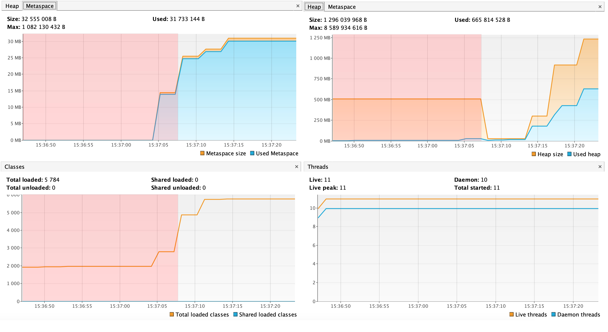
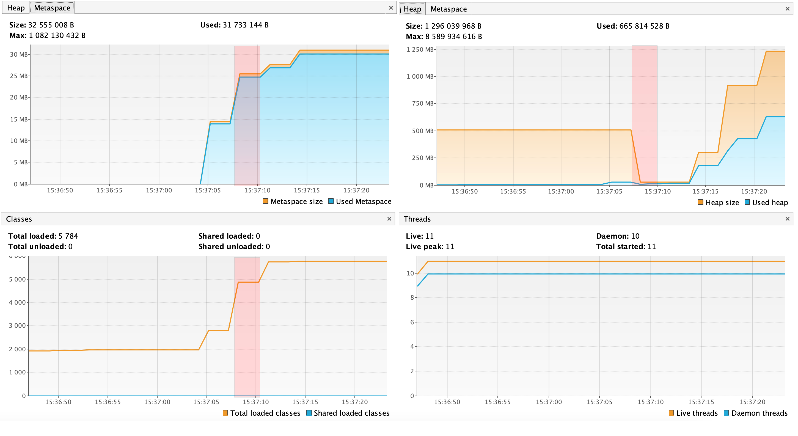
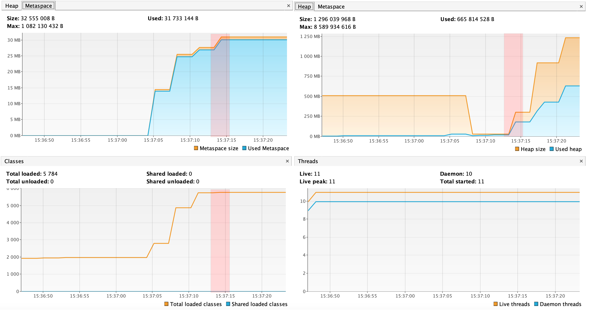
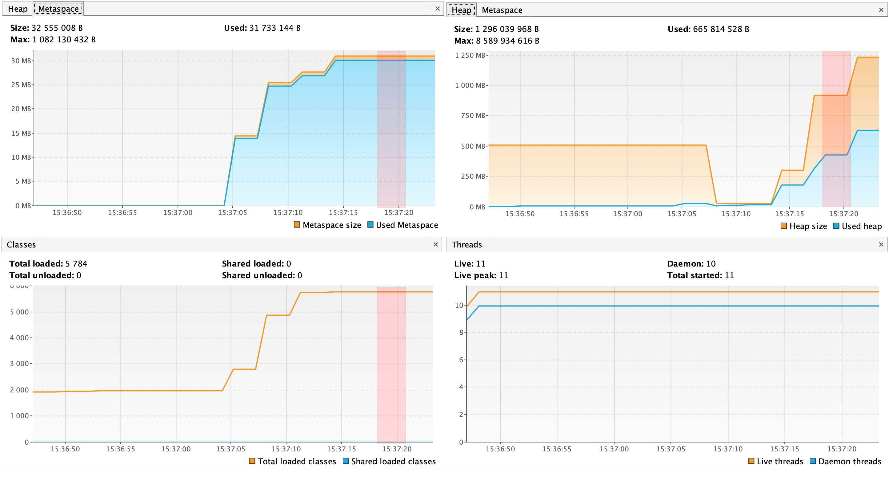
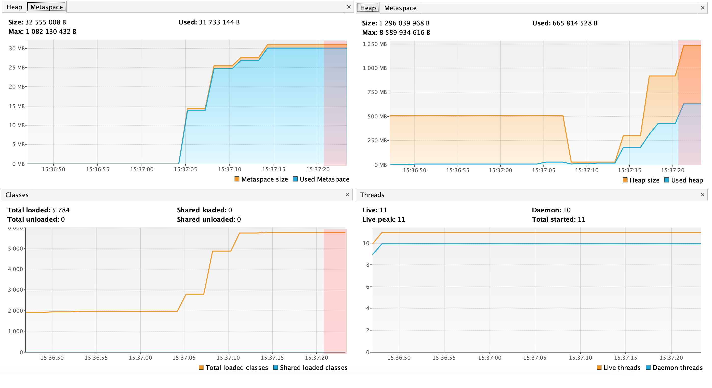

# Анализ работы программы

## Консольный вывод и его связь с графиками

### 1. Сообщение: "Please open 'ru.netology.JvmExperience' in VisualVm"
- **15:36:47**: Начало программы.
- **Событие**: Программа запрашивает открытие в VisualVM.
- **Графики**: На этом этапе графики должны быть стабильны, без значительных изменений.
  

### 2. Сообщение: "Загрузка классов из io.vertx"
- **15:37:07**: Через 30 секунд после запуска.
- **Событие**: Загрузка всех классов из пакета `io.vertx` в Metaspace.
- **Графики**: Визуализация должна показать рост использования Metaspace и, возможно, количества загруженных классов.
  

### 3. Сообщение: "Загрузка классов из io.netty"
- **15:37:10**: Через 33 секунды после запуска.
- **Событие**: Загрузка всех классов из пакета `io.netty`.
- **Графики**: Дальнейший рост Metaspace и количества классов.
  

### 4. Сообщение: "Загрузка классов из org.springframework"
- **15:37:13**: Через 36 секунд после запуска.
- **Событие**: Загрузка всех классов из пакета `org.springframework`.
- **Графики**: Виден значительный рост Metaspace и количества классов.
  

### 5. Сообщение: "now see heap"
- **15:37:16**: Через 39 секунд после запуска.
- **Событие**: Создание 5 миллионов объектов `SimpleObject`.
- **Графики**: Виден резкий рост Heap.
  

### 6. Добавление еще 5 миллионов объектов
- **15:37:19**: Через 42 секунды после запуска.
- **Событие**: Добавление второго блока по 5 миллионов объектов.
- **Графики**: Дальнейший рост Heap.
  

### 7. Добавление еще 5 миллионов объектов
- **15:36:22**: Через 45 секунд после запуска.
- **Событие**: Добавление третьего блока по 5 миллионов объектов.
- **Графики**: Максимальный рост Heap.
  